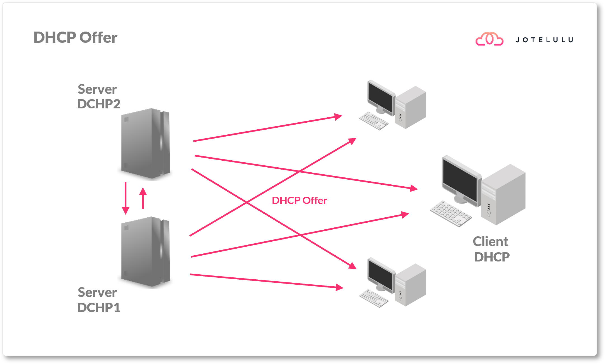
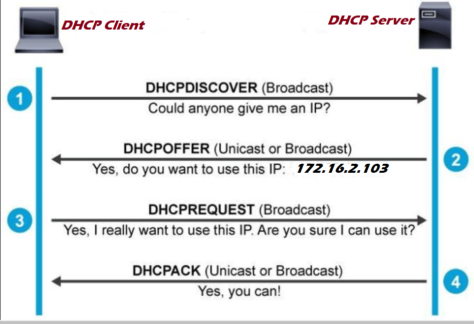
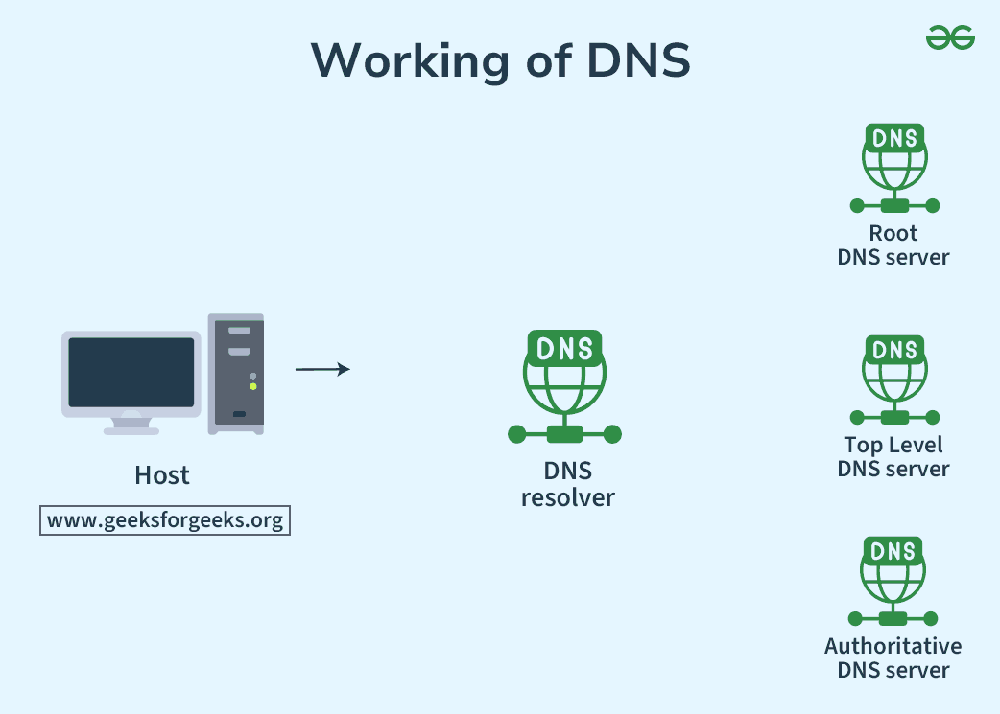
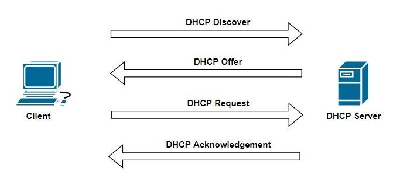

# DHCP and DNS Packet Tracer Exercises

This repository contains a collection of Cisco Packet Tracer exercises focusing on DHCP (Dynamic Host Configuration Protocol) and DNS (Domain Name System) configurations. These exercises are designed to help understand network protocols and their implementation in real-world scenarios.

*Figure 1: DHCP Offer Process*

## Contents

### DHCP Exercises
- `dhcpZero.pkt` - Basic DHCP configuration
- `dhcpZeroOne.pkt` - Extended DHCP configuration
- `dhcpOne.pkt` - Single router DHCP setup
- `DhcpTwoSwitch.pkt` - DHCP with two switches
- `DhcpTwoSwitchServer.pkt` - DHCP server configuration with two switches
- `TwoRouterDHCP.pkt` - DHCP configuration across two routers
- `#ProfTopoDhcp.pkt` - Professional topology DHCP setup

*Figure 2: Example Network Topology*

### DNS Exercises
- `dnsZero.pkt` - Basic DNS configuration
- `DhcpDnsWebserver.pkt` - Combined DHCP, DNS, and web server setup

*Figure 3: DNS Operation Animation*

### Routing Exercises
- `StaticRoutingTest.pkt` - Static routing configuration

*Figure 4: Network Configuration Example*

## Documentation
- `14030905DhcpDNS.mm.01.pptx` - Presentation on DHCP and DNS
- `14030905DhcpDef.mm.final.docx` - Detailed documentation

## Visual Resources
The repository includes several visual aids:
- `Working-of-DNS.gif` - Animation demonstrating DNS operation
- Various PNG/JPG files showing network topologies and configurations

*Figure 5: Additional Network Diagram*

## Getting Started

1. Ensure you have Cisco Packet Tracer installed on your system
2. Open any .pkt file to view and interact with the network topology
3. Each exercise builds upon the previous ones, so it's recommended to start with the basic configurations

## Exercise Progression

1. Start with `dhcpZero.pkt` for basic DHCP understanding
2. Progress to `DhcpTwoSwitch.pkt` for more complex scenarios
3. Move to `TwoRouterDHCP.pkt` for multi-router configurations
4. Explore DNS with `dnsZero.pkt`
5. Finally, try the combined setup in `DhcpDnsWebserver.pkt`

## Requirements
- Cisco Packet Tracer (latest version recommended)
- Basic understanding of networking concepts
- Familiarity with Cisco IOS commands

## Note
These exercises are part of a Computer Networks Lab course and are designed for educational purposes. Each file contains a different network topology and configuration to help understand various aspects of DHCP and DNS protocols. 